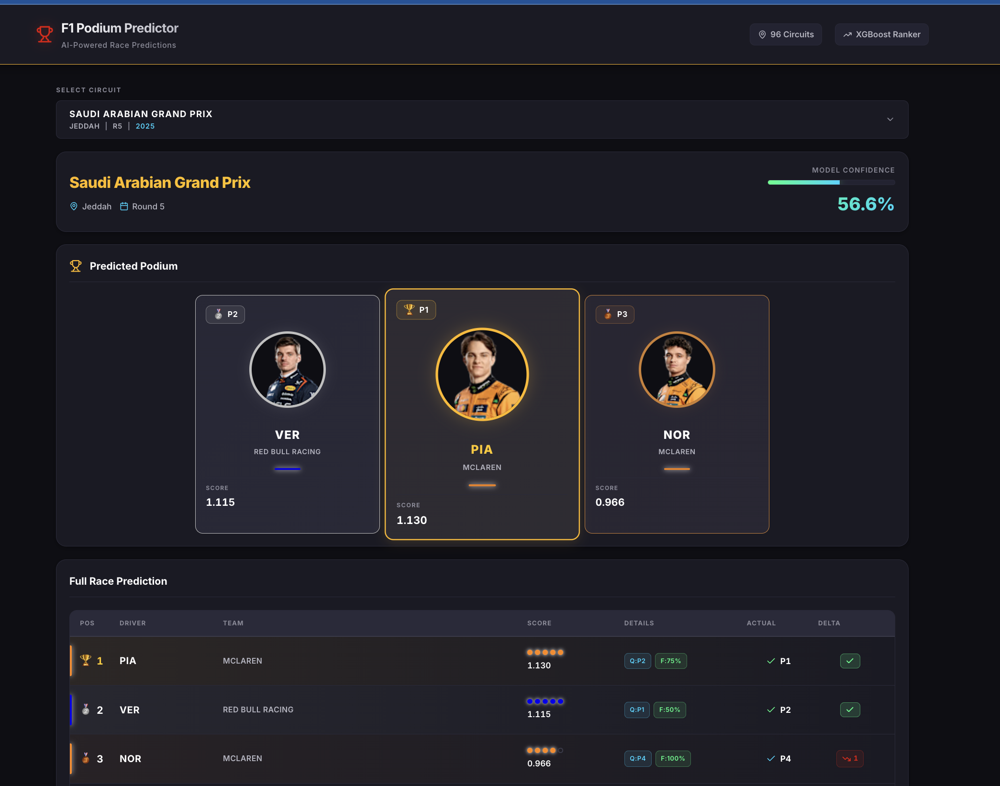

# 🏎️ F1 Podium Predictor

> ML-powered Formula 1 race predictions with interactive React dashboard

[](https://www.python.org/)
[](https://reactjs.org/)
[](LICENSE)

[Live Demo](#) • [Features](#features) • [Installation](#installation) • [Architecture](#architecture)

---

## 📋 Overview

I built an end-to-end machine learning system that predicts Formula 1 podium finishes using XGBoost, served through a Flask API with a modern React frontend.

**Key Achievement:** ±70% prediction accuracy (68%-72%) across 2022-2025 seasons (~90 races)

### Screenshot



---

## Features

### Machine Learning

- **XGBoost Ranking Model** trained on 2022-2025 F1 data
- **Feature Engineering:** Qualifying performance, recent form, race pace, historical circuit data
- **Multi-year Support:** Predictions for any race from 2022-2025
- **Confidence Scoring:** Statistical confidence metrics for each prediction

### Interactive Frontend

- **Year Selector:** Browse races from 2022-2025 with tab-based filtering
- **Live Podium Display:** Visual top-3 prediction with team colors
- **Full Grid Classification:** Complete race order with feature breakdowns
- **Actual Results Comparison:** Delta analysis when race results available
- **Responsive Design:** Works on desktop, tablet, and mobile

### Backend API

- **RESTful Flask API** with CORS support
- **FastF1 Integration:** Real-time F1 data fetching
- **Smart Caching:** Optimized data loading
- **Error Handling:** Graceful fallbacks for future races

---

## Tech Stack

| Layer        | Technology                    | Purpose                             |
| ------------ | ----------------------------- | ----------------------------------- |
| **ML**       | XGBoost, scikit-learn, pandas | Ranking model & feature engineering |
| **Data**     | FastF1, NumPy                 | F1 telemetry & session data         |
| **Backend**  | Flask, Python 3.9+            | REST API server                     |
| **Frontend** | React 18, Lucide Icons        | Interactive UI                      |
| **Styling**  | CSS3, Custom Design System    | Responsive layout                   |

---

## Quick Start

### Prerequisites

- Python 3.9+
- Node.js 16+
- npm or yarn

### Installation

1. **Clone repository**

```bash
   git clone https://github.com/YOUR-USERNAME/f1-podium-predictor.git
   cd f1-podium-predictor
```

2. **Backend setup**

```bash
   cd backend
   pip install -r requirements.txt
   python app.py
   # Server runs on http://localhost:5000
```

3. **Frontend setup** (new terminal)

```bash
   cd frontend
   npm install
   npm start
   # App runs on http://localhost:3000
```

4. **Open browser**

   Navigate to http://localhost:3000

---

## Model Performance

| Metric               | Value                  |
| -------------------- | ---------------------- |
| Mean Podium Accuracy | 68%                    |
| Mean MAE             | 3.253                  |
| Training Data        | ~90 races (2022-2025)  |
| Features             | 30 engineered features |
| Model Type           | XGBoost Ranker         |

**Feature Importance: (in terms of correlation to target variable)**

1. Qualifying position (65%)
2. Recent form (last 5 races) (60%)
3. Track podium rate (49%)
4. Historical circuit performance (33%)
5.

---

## Author

**Aidan Akdogan**

- Email: aidanakdogan@gmail.com

---

## Acknowledgments

- FastF1 library for F1 data access
- Online resources such as Claude and ChatGPT for helping me vibe code the frontend and teach myself relevant new concepts!
- Mar Antaya who's short videos inspired me to take on this project
- The world of F1 for being so rich in data!

---
